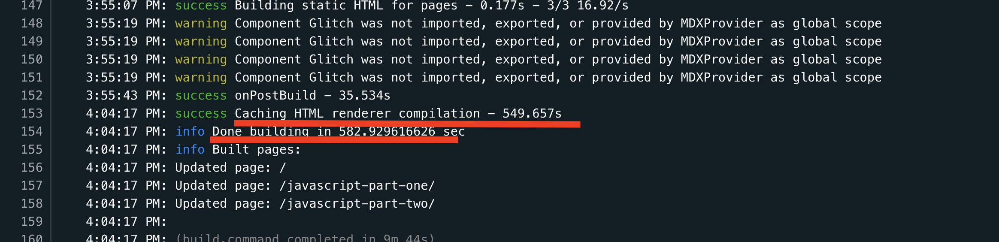

So I'm writing this blog post - all is good, I finish writing, checking it with Grammarly - and then I think: "OK, just three more minutes to deploy, and I'm done". 

I go to Github, create the PR for the branch with the new post, and then open Netlify to see how the deployment is going (for my PRs a new deploy is started automatically for preview.)

And I wait... and I wait.. and I wait... 10 minutes went on, I panic 
and I cancel the deploy. I'm thinking maybe there was a glitch in Netlify bowels and I start a new one. I wait again... Finally after 13 minutes (instead of 3) the build finishes.


> I'm on the free plan (Starter) on Netlify. It includes 300 minutes/30 days of build time. For all my account websites. So if one build takes 13 minutes, I have a problem.

I run the build on my local machine, the same build runs in 2 minutes so clearly something is very wrong somewhere. 
```
info Done building in 81.956853735 sec
```

But then I run the build again several times:
* The second time I run the build I get some strange webpack errors:
```
[webpack.cache.PackFileCacheStrategy] Caching failed for pack: Error: ENOENT: no such file or directory, rename '<project_folder>.cache/webpack/stage-build-html/1.pack_' -> '<project_folder>/.cache/webpack/stage-build-html/1.pack'
...
info Done building in 35.938077026 sec
```
But the build is still fast.
* The third time, the webpack errors are gone but the build is slow
```
info Done building in 375.343136062 sec
```

Same thing on Netlify, `Caching HTML renderer compilation` takes most of the build time:


My Gatsby 3 build seams blocked between `onPostBuild` and `Caching HTML renderer compilation`.

The cache is the issue. Instead of making the build faster, it makes it crazy slower 😞

Looking at my site's `netlify.toml` I see that I use a deprecated plugin for caching:
```
[[plugins]]
  package = "netlify-plugin-gatsby-cache" # gatsby fast build
```
Which was ironically making my build slow.

I've removed it.

> If you use this plugin, the cache will be created again, but a bit smaller this time.

After these changes, the build time is now 5 minutes. Not 3 as before but still better then 13.
