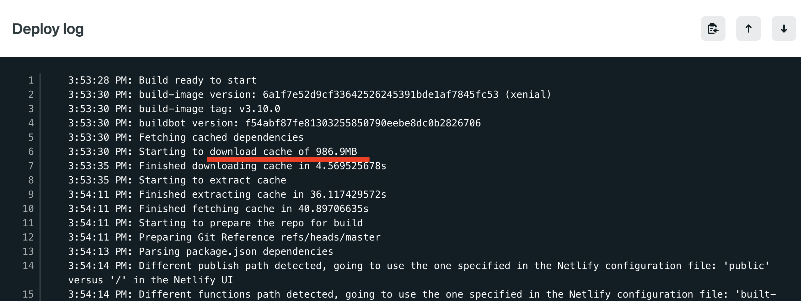
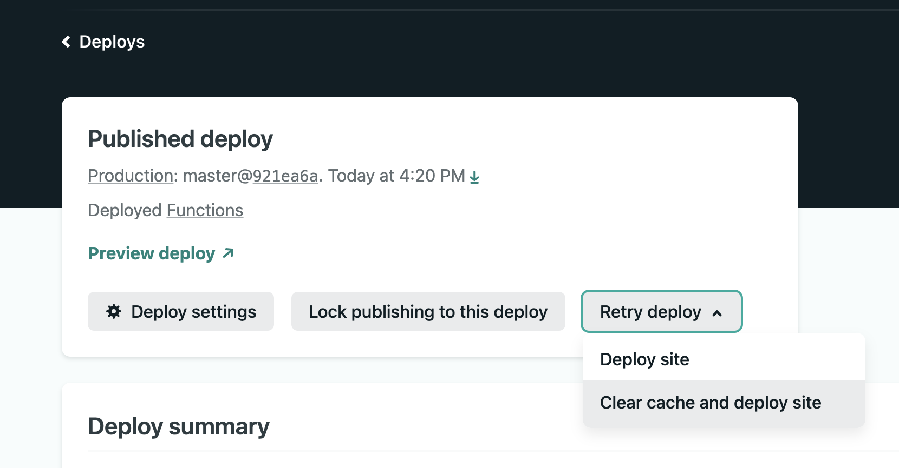
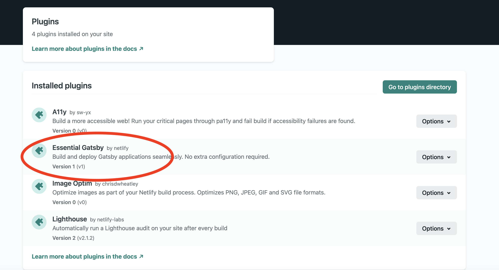

So I'm writing this blog post - all is good, I finish writing, checking it with Grammarly - and then I think: "OK, just three more minutes to deploy and I'm done". 

I go to Github, create the PR for the branch with the new post, and then open Netlify to see how the deploy is going (for my PRs a new deploy is started automatically for preview.)

And I wait... and I wait.. and I wait... 10 minutes went on, I panick 
and I cancel the deploy. I'm thinking maybe there was a glich in Netlify bowels and I start a new one. I wait again... Finally after 13 minutes the build finishes.


> I'm on the free plan (Starter) on Netlify. It includes 300 minutes/30 days of build time. For all my account websites.

In run the build on my local machine, the same build runs in 2 minutes so clearly something is very wrong somewhere. So I look at the Netlify build logs:

The first weird thing is that the cache is huge:

On my local machine the `.cache` + `public` folders are under 60Mb. Where are the other 900Mb coming from?

The other weird thing is that the `Caching HTML renderer compilation` takes most of the build time:

My Gatsby 3 build seams blocked between `onPostBuild` and `Caching HTML renderer compilation`.

The cache is clearly the issue. Instead of making the build faster it makes it crazy slow.

There are two fixes I did:

## Clear the cache
To get rid of the huge cache you need to got to your site page on Netlify, choose Deploys, select the last deploy, and from "Retry deploy" dropdown, redeploy the site with "Clear cache and redeploy site" option:


## Use the new Essential Gatsby plugin
Looking at my site's `netlify.toml` I see that I use a deprecated plugin for caching:
```
[[plugins]]
  package = "netlify-plugin-gatsby-cache" # gatsby fast build
```
Which was ironically making my build slow.

I've removed it, and from the my website's Plugins page I've added "Essential Gatsby" plugin:


That's all. 
Hope this helps.