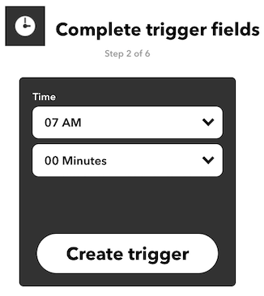
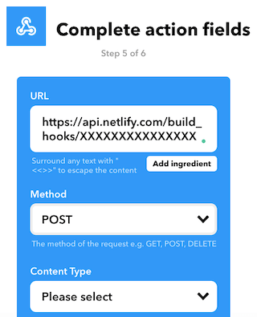

I'm building this blog with Gatsby, as I've already [explained](/how-i-made-this-site-with-gatsby-convertkit-and-netlify/).
The blog is still in progress, and I'm adding new features -- like generating [Twitter cards](/how-to-automate-twitter-card-images-for-your-blog/) for blog posts -- as I need them.

One of the new things I wanted to add was the ability to schedule blog posts at certain dates in the future.
More exactly what I want is this:
* create blog posts with future dates (frontmatter date)
* Gatsby build ignores posts with future dates
* run Gatsby build every day to pick up posts that are up to date

The first two steps can be done in code, that last one depends on how you hook Gatsby build. 


### How to ignore future posts
I write all the posts in MDX and set a frontmatter to all of them. For example, the frontmatter of this post looks like this:
```
---
title: How to ignore future blog posts with Gatsby
date: 2020-06-21
description: Some static sites generators ignore out-of-the-box the blog posts with future dates, this is not available by default in Gatsby but can be implemented easily.
keywords: ['Gatsby']
---
```
The frontmatter includes the post date. Based on that a post is considered a future post
if it's date is in the future.

So, to ignore the future post we need to somehow update the GraphQL query that generates the post,
to filter the posts with future dates.

The most direct way would be something like this:
```JavaScript
const result = await graphql(`
    query {
      allMdx((filter: {frontmatter: {date: {lt: $TODAY}}})) {
        edges {
          node {
            id
            frontmatter{
              title
              date
            }
            fields {
              slug
            }
          }
        }
      }
    }
  `)
```
But that didn't work, I couldn't figure a way to make the query dynamic to use the current date.
What can be done instead is to create a new field on each MDX node, called `isFuturePost` with a boolean value:
true is the post is in future, false otherwise.

In gatsby-node.js, inside `onCreateNode()` we add the new field like this: 
```JavaScript
exports.onCreateNode = ({ node, actions, getNode }) => {
  const { createNodeField } = actions

  if (node.internal.type === `MarkdownRemark` || node.internal.type === `Mdx`) {
    ...

    // create a marker for future posts  
    const postDate = node.frontmatter.date; 
    const isFuturePost = !postDate || (new Date(postDate)).getTime() > Date.now() 
    createNodeField({  
      name: `isFuturePost`, 
      node,  
      value: isFuturePost, 
    }) 
  }
}
```
Now, after we restart gatsby develop, we can use it to filter the posts.
First we don't generate pages for future posts in `gatsby-node.js`
```JavaScript
exports.createPages = async ({ graphql, actions }) => {
  const { createPage } = actions

  const blogPost = path.resolve(`./src/templates/blog-post.js`)
  const result = await graphql(`
    query {
      //...
      allMdx(filter: {fields: {isFuturePost: {eq: false}}}) { 
        edges {
          node {
            id
            frontmatter{
              title
              date
            }
            fields {
              slug
            }
          }
        }
      }
    }
  `)

  //...

}  
```

Next we don't add future post on the posts list, in `index.js`
```JavaScript
export const pageQuery = graphql`
  query {
    site {
      siteMetadata {
        title
        description
      }
    }
    allMdx(
      sort: { fields: [frontmatter___date], order: DESC },
      filter: {fields: {isFuturePost: {eq: false}}}   
    ) {
      edges {
        node {
          excerpt
          fields {
            slug           
          }
          timeToRead
          frontmatter {
            date(formatString: "MMMM DD, YYYY")
            title
            keywords
          }
        }
      }
    }
  }
`
```
And finally, at least in my case, stop the RSS feed to include the future posts, 
in `gatsby-config.js`:
```JavaScript
feeds: [
  {
    serialize: ({ query: { site, allMdx } }) => {
        return allMdx.edges.map(edge => {
        return Object.assign({}, edge.node.frontmatter, {
            description: edge.node.excerpt,
            date: edge.node.frontmatter.date,
            url: site.siteMetadata.siteUrl + edge.node.fields.slug,
            guid: site.siteMetadata.siteUrl + edge.node.fields.slug,
            custom_elements: [{ "content:encoded": edge.node.html }]
        });
        });
    },
    query: `{
        allMdx(
            sort: { order: DESC, fields: [frontmatter___date] },
            filter: {fields: {isFuturePost: {eq: false}}}  
        ) {
            edges {
            node {
                excerpt
                html
                fields { slug }
                frontmatter {
                title
                date
                }
            }
            }
        }
    }`,
    output: "/rss.xml",
    title: "Rares Portan's RSS Feed",
  }
]

```
Basically, you need to look for `allMdx` queries and add the filter in them.

Note that if you want Gatsby to build your post so you can preview it, you need to temporarily
set the date to the present day, otherwise it will be completely ignored for now, which is exactly what
we wanted.


## Bonus: Trigger automatic builds on Netlify.
The last step that we need to do is to run Gatsby build every day to pick up posts that are up to date.
Of course, this depends on how you host your site and how you call Gatsby build. 
Since I'm hosting my site on Netlify I'll explain how I do it and hopefully, you can do something similar.

### Add a Netlify build hook
Netlify provides build hooks, URLs that when called, start a build.
You need to add (or reuse if you already have one) a [build hook for your site](https://docs.netlify.com/configure-builds/build-hooks/#parameters).

## Make a trigger
Now that we have the hook, we somehow need to call it every day automatically.
Sadly Netlify doesn't provide (yet?) scheduled deploys so we need to find something else.
You can automate this in many ways, for example using IFTTT or Zapier.

You can automate this in many ways, for example using [IFTTT](https://ifttt.com/).
After you sign up, [create a new applet](https://ifttt.com/create).
You'll see 'If ✚This Then That'.

Click on ✚This and search for Date & Time service and set it up as you need.
For example, I set it at 7:00 AM every day, but you can choose to build only on a specific days, e.g every Monday and Friday.


Them click on ✚That and search for Webhooks, then choose Make a web request and fill in 
the Netlify build hook URL. Also, select POST as Method.


You're done. Tomorrow you'll see the build in action.


