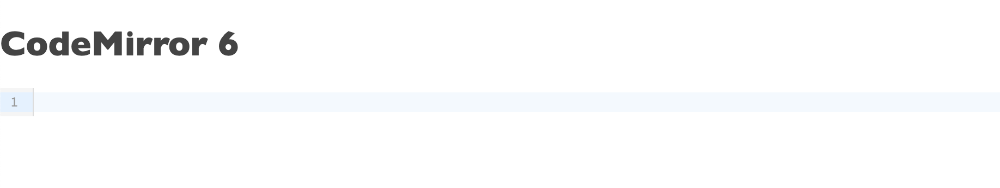

These days hands-on, in the browser, programming language tutorials are the standard. They all provide some kind of code editor.
People learn by typing some code in those editors and instant feedback tells them the outcome.

What if you want to create such a platform? Especially one that works on a touchscreen and that is accessible?
You want to create something like [Codecademy](https://www.codecademy.com/), [Educative](https://www.educative.io/), or [Codewars](https://www.codewars.com/)? 
I do so that's why I created [Live JavaScript](https://livejs.netlify.app/).

But now it's time for an upgrade, so I started to see what code editor I should use there. I tried several code editors, but one stood out: [CodeMirror](https://codemirror.net/6/). 
Marijn Haverbeke is doing a complete rewrite of the existing code base, and the new CodeMirror is a great piece of software. I hope this small guide will encourage you to give it a try.

By all means, this is *not* an exhaustive tutorial of CodeMirror 6. There are just too many things it can do. Maybe that is a problem, is a bit hard to find what you need. This is just a quick get-started guide.


## Setup
CodeMirror 6 is published as a set of NPM packages under the `@codemirror` scope. Each package exposes ECMAScript and CommonJS modules. 
So we need to use some kind of bundler or loader to run them in the browser.

First, create a new folder for the project and initialize a new npm project inside:
```
npm init -y
```
Then install the CodeMirror6 packages:
```
npm i @codemirror/basic-setup @codemirror/lang-javascript
```

Now we can create the main editor file,`editor.js`, adding the following:
```JavaScript
import {EditorState, EditorView, basicSetup} from "@codemirror/basic-setup"
import {javascript} from "@codemirror/lang-javascript"

let editor = new EditorView({
  state: EditorState.create({
    extensions: [basicSetup, javascript()]
  }),
  parent: document.body
})
```

Let's create a `styles.css`:
```CSS
html, 
body {
    margin: 0;
    padding: 0;
    background: #fff;
    color: #444;
    font-family: 'Gill Sans','Gill Sans MT',Calibri,'Trebuchet MS',sans-serif
}
```

Finally let's create an HTML file, `index.html` that uses the script bundle and the CSS file:
```HTML
<!DOCTYPE html>
<html lang="en">
<head>
  <meta charset="UTF-8">
  <meta http-equiv="X-UA-Compatible" content="IE=edge">
  <meta name="viewport" content="width=device-width, initial-scale=1.0">
  <title>CodeMirror6</title>
  <link rel=stylesheet href="styles.css">
</head>
<body>
    <main>
        <h1>CodeMirror 6</h1>
        <div id="editor">
            <!-- code editor goes here  -->
        </div>
    </main>
    <script src="editor.bundle.js"></script>  
</body>
</html>
```
The `editor.bundle.js` is missing for the moment. We need to generate it from `editor.js` somehow.
There are several ways, using a tool like Webpack or Rollup. Here we use Rollup.

### Rollup
We need to install Rollup:
```
npm i rollup @rollup/plugin-node-resolve
```
Now let's create a Rollup configuration file, called `rollup.config.js`:
```JavaScript
import {nodeResolve} from "@rollup/plugin-node-resolve"
export default {
  input: "./editor.js",
  output: {
    file: "./editor.bundle.js",
    format: "iife"
  },
  plugins: [nodeResolve()]
}
```
To make things simple edit the `package.json` and add a `"start": "rollup -c"` script.
`package.json` should be something like this:
```JSON
{
  "name": "codemirror6",
  "version": "1.0.0",
  "description": "",
  "main": "index.js",
  "scripts": {
    "start": "rollup -c"
  },
  "author": "",
  "license": "ISC",
  "dependencies": {
    "@codemirror/basic-setup": "^0.18.2",
    "@codemirror/lang-javascript": "^0.18.0",
    "@rollup/plugin-node-resolve": "^13.0.0",
    "rollup": "^2.50.6"
  }
}
```

### Build the bundle
Now, if everything is set up correctly we can run: 
```
npm start
```
And this will generate the `editor.bundle.js` file.

Open `index.html` in a browser and you'll see a single line of the editor:


If we look at the source code, we can see that the editor was added in the body:
```HTML
<div class="cm-editor cm-wrap ͼ1 ͼ2 ͼ4">
    <div aria-live="polite" style="position: absolute; top: -10000px;"></div>
    <div tabindex="-1" class="cm-scroller">
        <div class="cm-gutters" aria-hidden="true" style="position: sticky; min-height: 26px;">
            <div class="cm-gutter cm-lineNumbers">
                <div class="cm-gutterElement" style="height: 0px; visibility: hidden; pointer-events: none;">9</div>
                <div class="cm-gutterElement cm-activeLineGutter" style="height: 18px; margin-top: 4px;">1</div>
            </div>
            <div class="cm-gutter cm-foldGutter">
                <div class="cm-gutterElement" style="height: 0px; visibility: hidden; pointer-events: none;">
                    <span title="Unfold line">›</span>
                </div>
                <div class="cm-gutterElement cm-activeLineGutter" style="height: 18px; margin-top: 4px;"></div>
            </div>
        </div>
        <div spellcheck="false" autocorrect="off" autocapitalize="off" contenteditable="true" class="cm-content" style="tab-size: 4" role="textbox" aria-multiline="true" aria-autocomplete="list">
            <div class="cm-activeLine cm-line"><br></div>
        </div>
        <div class="cm-selectionLayer" aria-hidden="true"></div>
        <div class="cm-cursorLayer" aria-hidden="true" style="animation-duration: 1200ms;">
            <div class="cm-cursor cm-cursor-primary" style="left: 34.8125px; top: 5px; height: 15px;"></div>
        </div>
    </div>
</div>
```

## CodeMirror 
CodeMirror is a collection of modules that provide a full-featured text and code editor. 
This means that you can pick and choose which features you need, but setting up an editor requires you to put together a bunch of pieces.

Let's go back to the `editor.js` source to see what is happening there:
```JavaScript
import {EditorState, EditorView, basicSetup} from "@codemirror/basic-setup"
import {javascript} from "@codemirror/lang-javascript"

let editor = new EditorView({
  state: EditorState.create({
    extensions: [basicSetup, javascript()]
  }),
  parent: document.body
})
```
There are two parts: 
* state (EditorState): which contains the data structures that model the editor state (the editor state is made up of a current document and a selection)
* view (EditorView): which provides the UI of the editor.

The editor will be rendered inside the body. If you want it to render somewhere else you just need to change the element selector set to `parent`.


### Language
A real code editor needs key bindings, highlighting, a line number gutter or an undo history, etc. While you can add each manually,
CodeMirror provides a "basic-setup" package that includes all the functionality of a code editor. This is why we use "@codemirror/basic-setup".

You can see that we also use the "@codemirror/lang-javascript" package. Since each programming language has its specific rules and features, we need to
use the correct language package. This way we benefit from a parser, autocompletion, highlighting, and so on.

Before you can use a different language you need to install the corresponding package. Here are some examples:
```
npm i @codemirror/lang-html
npm i @codemirror/lang-css
npm i @codemirror/lang-json
```
When I'm writing this CodeMirror supports CSS, C++, HTML, Java, JavaScript, JSON, Markdown, Python, Rust, and XML.

Then you import and use the package,e.g. here is how to use the `lang-html`:
```JavaScript
import {EditorState, EditorView, basicSetup} from "@codemirror/basic-setup"
import {html} from "@codemirror/lang-html"

let editor = new EditorView({
  state: EditorState.create({
    extensions: [basicSetup, html()]
  }),
  parent: document.body
})
```

### Document initial value

To set a start value for the editor you just need to set the state's `doc` property to the value.
For example, if the initial editor value is:
```HTML
<html lang="en">
<body>
    <h1>CodeMirror 6</h1>
    <script src="editor.bundle.js"></script>  
</body>
</html>
```
Then we set it as `doc` value:
```JavaScript
import {EditorState, EditorView, basicSetup} from "@codemirror/basic-setup"
import {html} from "@codemirror/lang-html"

let editor = new EditorView({
  state: EditorState.create({
    extensions: [basicSetup, html()],
    doc:`<html lang="en">
<body>
    <h1>CodeMirror 6</h1>
    <script src="editor.bundle.js"></script>  
</body>
</html>`
  }),
  parent: document.body
})
```


### Reading and setting the document's text
To read the current text displayed by the editor you do:
```JavaScript
const currentValue = editor.state.doc.toString();

// <html lang="en">
// <body>
//    <h1>CodeMirror 6</h1>
//    <script src="editor.bundle.js"></script>  
// </body>
// </html>
```


You can change the value in multiple ways by dispatching changes. 
*DO NOT change the doc directly.*
* Inserting text
```JavaScript
editor.dispatch({
  changes: {from: 0, insert: "<!DOCTYPE html>\n"}
})

// <!DOCTYPE html>
// <html lang="en">
// <body>
//    <h1>CodeMirror 6</h1>
//    <script src="editor.bundle.js"></script>  
// </body>
// </html>
```
* Replacing text
```JavaScript
const currentValue = editor.state.doc.toString();
const startPosition = currentValue.indexOf("editor.bundle.js");
const endPosition = startPosition + "editor.bundle.js".length;

editor.dispatch({
  changes: {
    from: startPosition, 
    to: endPosition,
    insert: "code-mirror-editor.js"}
})

// <!DOCTYPE html>
// <html lang="en">
// <body>
//    <h1>CodeMirror 6</h1>
//    <script src="code-mirror-editor.js"></script>  
// </body>
// </html>
```
So to replace everything you just need to get the current text length:
```JavaScript
const currentValue = editor.state.doc.toString();
const endPosition = currentValue.length;

editor.dispatch({
  changes: {
    from: 0, 
    to: endPosition,
    insert: "something else"}
})
````
You can dispatch multiple changes at once if you need that, `changes` must be an array of individual changes.

### Listen for changes
Usually, you want to listen for change and do something with the new code, for example, to reinterpret/evaluate the code. This is 
done by adding a `updateListener` to the editor view like this:
 ```JavaScript
import {EditorState, EditorView, basicSetup} from "@codemirror/basic-setup"
import {html} from "@codemirror/lang-html"

let editor = new EditorView({
  state: EditorState.create({
    extensions: [
      basicSetup, 
      html(),
      EditorView.updateListener.of((v)=> {
      if(v.docChanged) {
          console.log('DO SOMETHING WITH THE NEW CODE');
      }
    })]],    
  }),
  parent: document.body
})
```
Of course, if you don't want to do a lot of processing each time a key is pressed you need to use a timeout there:
```JavaScript
import {EditorState, EditorView, basicSetup} from "@codemirror/basic-setup"
import {html} from "@codemirror/lang-html"

let timer;

let editor = new EditorView({
  state: EditorState.create({
    extensions: [
      basicSetup, 
      html(),
      EditorView.updateListener.of((v)=> {
        if(v.docChanged) {
          if(timer) clearTimeout(timer);
          timer = setTimeout(() => {
            console.log('DO SOMETHING WITH THE NEW CODE');
          }, 500 );
        }
      })
    ],    
  }),
  parent: document.body
})
```

## Themes
Themes, like anything else, can be provided as NPM packages. Or you can provide your theme.
For the moment (CodeMirror6 is still in beta) there is only one dark theme you can install, `One Dark`:
```
npm i @codemirror/theme-one-dark
```

You can use a theme just like anything else: you import it and use it as an extension:
```JavaScript
import {EditorState, EditorView, basicSetup} from "@codemirror/basic-setup"
import {html} from "@codemirror/lang-html"
import { oneDarkTheme } from "@codemirror/theme-one-dark";

let timer;

let editor = new EditorView({
  state: EditorState.create({
    extensions: [
      basicSetup, 
      html(),
      oneDarkTheme,     
    ],    
  }),
  parent: document.body
})
```


As I've said you can use your theme. CodeMirror 6 uses CSS-in-JS.

```JavaScript
let myTheme = EditorView.theme({
  "&": {
    color: "white",
    backgroundColor: "#034"
  },
  ".cm-content": {
    caretColor: "#0e9"
  },
  "&.cm-focused .cm-cursor": {
    borderLeftColor: "#0e9"
  },
  "&.cm-focused .cm-selectionBackground, ::selection": {
    backgroundColor: "#074"
  },
  ".cm-gutters": {
    backgroundColor: "#045",
    color: "#ddd",
    border: "none"
  }
}, {dark: true})
```
If you don't want to provide styles for everything, you can extend the base theme and overwrite only parts of it. Here is an example 
that changes the editor font family and size:
```JavaScript
import {EditorView} from "@codemirror/view"

const myTheme = EditorView.baseTheme({
  "&.cm-editor": {
    fontSize: '16px',
  },
  ".cm-scroller": {
    fontFamily:'Consolas, Menlo, Monaco, source-code-pro, Courier New, monospace'
  },
})
```

## Putting all together
The only missing piece is a code evaluator, which for JavaScript is easy to do (since this runs in the browser).
Just add some `console.log()` to see the results of the code execution on the browser's DevTools console.

```Javascript
import {EditorState, EditorView, basicSetup} from "@codemirror/basic-setup"
import {javascript} from "@codemirror/lang-javascript"

const jscode='';
const myTheme = EditorView.baseTheme({
  "&.cm-editor": {
    fontSize: '16px',
  },
  ".cm-scroller": {
    fontFamily:'Consolas, Menlo, Monaco, source-code-pro, Courier New, monospace'
  },
})

let timer;

const evaluateCode = (code) => {
  console.clear();
  try{
    Function(code)(window);
  }
  catch(err) {
    console.error(err);
  }
}

let editor = new EditorView({
  state: EditorState.create({
    extensions: [
      basicSetup, 
      javascript(),
      myTheme,
      EditorView.updateListener.of((v)=> {
        if(v.docChanged) {
          if(timer) clearTimeout(timer);
          timer = setTimeout(() => {
            evaluateCode(editor.state.doc.toString())
          }, 500 );
        }
      })
    ],    
    doc: jscode
  }),
  parent: document.body
})
```


And that is all. You have a nice JavaScript playground that can be integrated into a bigger platform.


## Resources
* [CodeMirror](https://codemirror.net/6)
* [CodeMirror Document changes](https://codemirror.net/6/examples/change/)
* [CodeMirror Styling](https://codemirror.net/6/examples/styling/)
* [CodeMirror Forum](https://discuss.codemirror.net/t/codemirror-6-proper-way-to-listen-for-changes/2395/5)