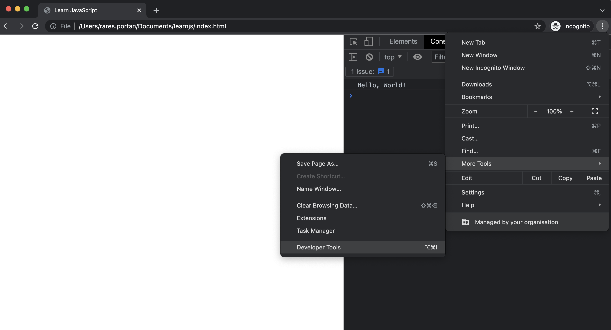
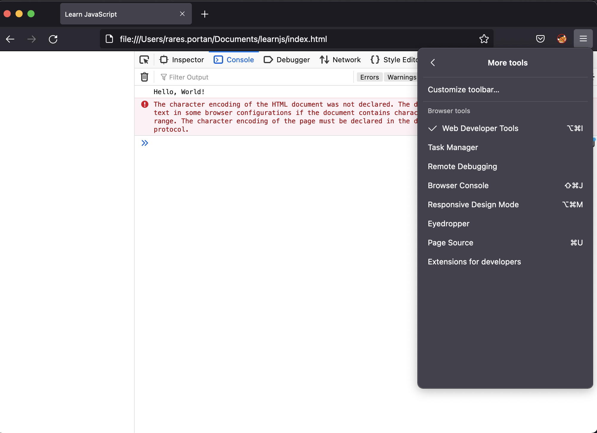
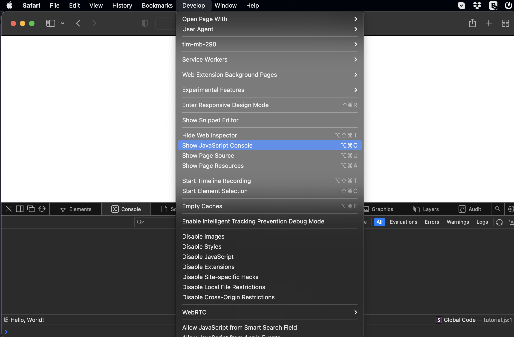
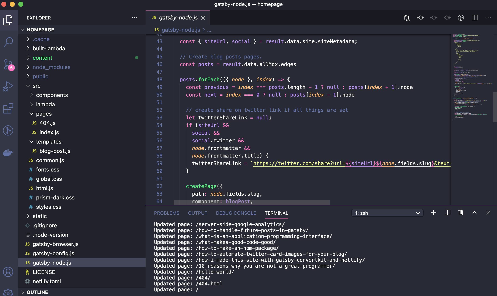

This is the second part of the "Let's Learn JavaScript" tutorial. 
[In the first part](/javascript-part-one), we learned how JavaScript compares to other programming languages and the mindset you need to learn JavaScript.

Now we learn to make and run our first JavaScript program, of course, the classic "Hello, World!"

## JavaScript code

Create a folder called `learnjs` and inside it, a file called `tutorial.js` and enter the following text inside:
```JavaScript
console.log("Hello, World!");
```
That's all. One-liner.

## Running JavaScript code
To run JavaScript code we need a JavaScript *runtime*, a tool that reads JavaScript code and executes it.
JavaScript was designed to be lightweight and to run inside a browser, but [Ryan Dahl](https://en.wikipedia.org/wiki/Ryan_Dahl) created 
[Node.js](https://nodejs.org/en/) that runs JavaScript on servers.

> Unlike some other programming languages like C or Java, JavaScript code is not *compiled*. This means that you don't know if the code 
works before you execute it.

If the code doesn't work, you'll get some errors that say what's wrong.

Note that there is some JavaScript code that works only in the browser or only in Node.js. That JavaScript code is not core JavaScript, 
but some extra APIs added by either the browser or Node.js.

In this tutorial, we will use only JavaScript code that is compatible with both. So choose one of the methods and stick to it.

### Browser 
To run JavaScript inside the browser you'll need to create first an HTML file.
In the same `learnjs` folder, create an `index.html` file with the following content:

```HTML
<html>
  <head>
    <title>Learn JavaScript</title>
    <head>
  <body>
    <script src="tutorial.js"></script>
  <body>
</html>    
```
The most relevant line for us is `<script src="tutorial.js"></script>` which loads `tutorial.js`.

Now open `index.html` with a browser. You'll see an empty page, that is fine. 
To see the "Hello, World!" text, you need to open the browser's JavaScript console. How you do this depends on the browser, but here are some examples:

#### Chrome


#### Firefox


#### Safari (first you need to [enable "Develop" menu](https://support.apple.com/en-gb/guide/safari/sfri20948/mac))



### Node.js
First, you need to install Node.js from [https://nodejs.org/en/](https://nodejs.org/en/)
Once you did that, verify that all is OK by checking the node.js version. In a terminal/cmd run the following:
```shell
node -v
```
If that works go to the `learnjs` folder and, again using the terminal, type:
```shell
node tutorial.js
```
You should see "Hello, World!" displayed.


## Visual Studio Code
Most programmers use some sort of [IDE](https://en.wikipedia.org/wiki/Integrated_development_environment) to help them code faster and with
fewer mistakes. Not to mention project structure and settings.

For JavaScript developers (and web developers in general), I recommend [Visual Studio Code](https://code.visualstudio.com/) these days.
Go ahead install it and use it, it's free and it's awesome.



## Summary
* JavaScript code goes in files with `.js` extension
* JavaScript can run in browsers or node.js
* Use an IDE like Visual Studio Code to be more productive

This concludes the second part of the tutorial. You now know how to run JavaScript code.
In the next part, we will learn a few JavaScript basic concepts.


