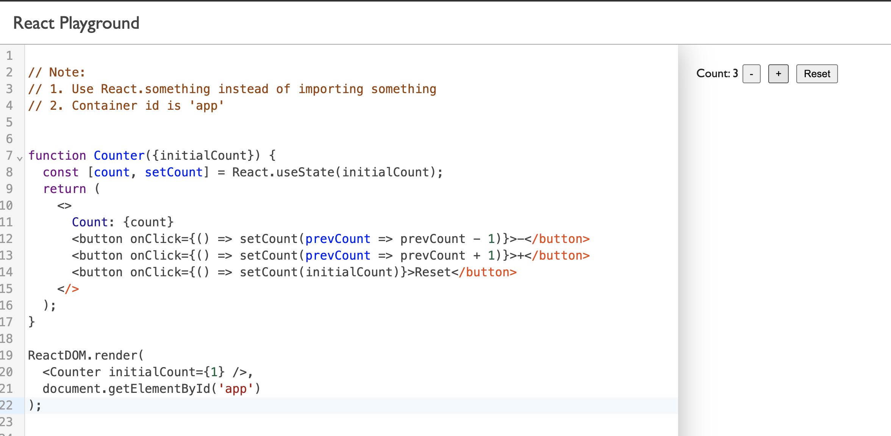

The playground has two parts:
* The code editor: Allows us to enter the React code we want to evaluate
* The code evaluation sandbox: Evaluates (executes) the React code from the code editor and creates the corresponding DOM 

In the left we have the editor and in the right we have the sandbox iframe. Each time the code is changed, the sandbox evaluates the code again.


##  Setting up the sandbox 
We run everything in the browser, so we need to load the two React scripts: `react.js` and `react-dom.js`.

```HTML
<!-- Load React. -->
<!-- Note: when deploying, replace "development.js" with "production.min.js". -->
<script src="https://unpkg.com/react@17/umd/react.development.js" crossorigin></script>
<script src="https://unpkg.com/react-dom@17/umd/react-dom.development.js" crossorigin></script>
```

We also want JSX, so we need Babel to traspile JSX to plain JavaScript. Usually we use Babel at build time, but here we 
need it at runtime, so we need to use the standalone version.

```HTML
<script src="https://unpkg.com/babel-standalone@6/babel.min.js"></script>
```

When we need to traspile code, we use Babel like this:
```JavaScript
try {
    let result = Babel.transform(code, { presets: ["env", "es2015", "react"] }).code;
    Function(result)(window);
}
catch(err){
}    
```

Everytime we change the code we want to evaluate, we need to get rid of the current evaluation result (all DOM nodes created by the current evaluation).
There are several ways to do this, but I prefer to put the code evaluation piece in a separate iframe, `sandbox.html`

```HTML
<!DOCTYPE html>
<html>
<head>
   <script src="https://unpkg.com/react@17/umd/react.development.js" crossorigin></script>
   <script src="https://unpkg.com/react-dom@17/umd/react-dom.development.js" crossorigin></script>
   <script src="https://unpkg.com/@babel/standalone/babel.min.js"></script>
   <script>
        let origin;

        // listen for messages
        window.addEventListener('message', e => {
            origin = e.source;
            document.getElementById('error').style.display='none';
            document.getElementById('app').style.display='block';

            const { code } = e.data;
            if (code) {
                // here the code is evaluated in the iframe
                try {
                  let result = Babel.transform(code, { presets: ["env", "es2015", "react"] }).code;
                  Function(result)(window);
                }
                catch(err){
                  document.getElementById('app').style.display='none';
                  document.getElementById('error').style.display='block';
                  document.getElementById('error').innerHTML = err.message;
                }
            }
        });
    </script>
</head>
<body>
  <pre id="error">

  </pre>
  <div id="app"></div>
</body>
</html>

```
Inside the iframe we have 
* a `pre` that displays the error details if necessary
* a div with id "app" that is the container used by the React.
Only one of them is displayed at a time.


## Code editor

We already covered [setting up CodeMirror](/how-to-make-a-code-editor-with-codemirror6/), so we won't do that here.
The part I want to highligh here is the code evaluation( calling `evaluateCode()` ) which is done 
* when the page is loaded
* each time the user changes the code in the editor

```JavaScript
const editor = new EditorView({
  state: EditorState.create({
    extensions: [
      basicSetup, 
      javascript(),
      myTheme,
      EditorView.updateListener.of((v)=> {
        if(v.docChanged) {
          if(timer) clearTimeout(timer);
          timer = setTimeout(() => {
            evaluateCode(editor.state.doc.toString())
          }, 500 );
        }
      })
    ],    
    doc: ''
  }),
  parent: document.getElementById('editor')
})

// first time evaluation
window.addEventListener('DOMContentLoaded', (event) => {
  setTimeout( () => {
   evaluateCode(editor.state.doc.toString())
  }, 1000);
})
```

The evaluation function simply sends the code to the sandbox iframe:
```JavaScript
const evaluateCode = (code) => {
  console.clear();
  try{
    const sandbox = document.getElementById('sandbox');
    sandbox.contentWindow.postMessage({ code }, '*');
  }
  catch(err) {
    console.error(err);
  }
}
```

## Putting them together

Inside `index.html` we load the `editor.bundle.js` which will create the code editor and also the sandbox iframe.
Note that we need set some properties to allow the iframe to execute the code we send to it.

```HTML
<!DOCTYPE html>
<html lang="en">
<head>
  <meta charset="UTF-8">
  <meta http-equiv="X-UA-Compatible" content="IE=edge">
  <meta name="viewport" content="width=device-width, initial-scale=1.0">
</head>
<body>
    <header>
      React Playground
    </header>
    <main>        
        <div id="editor"></div>
        <!-- SANDBOX -->
        <iframe id="sandbox" src="./sandbox.html" sandbox='allow-scripts allow-same-origin allow-forms'></iframe>
    </main>
    <!-- EDITOR -->
    <script src="editor.bundle.js"></script>  
</body>
</html>
```


## Resouces

* [react-playground](https://github.com/raresportan/react-playground)
* [Add React to a Website](https://reactjs.org/docs/add-react-to-a-website.html)