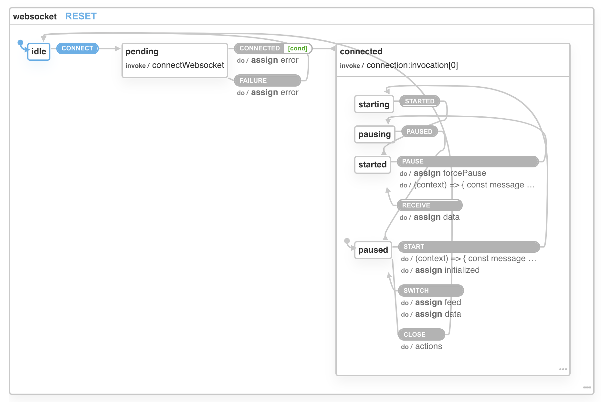
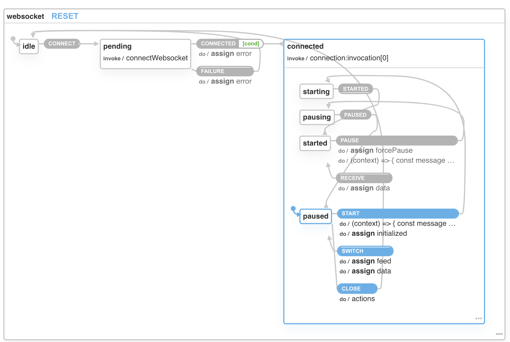
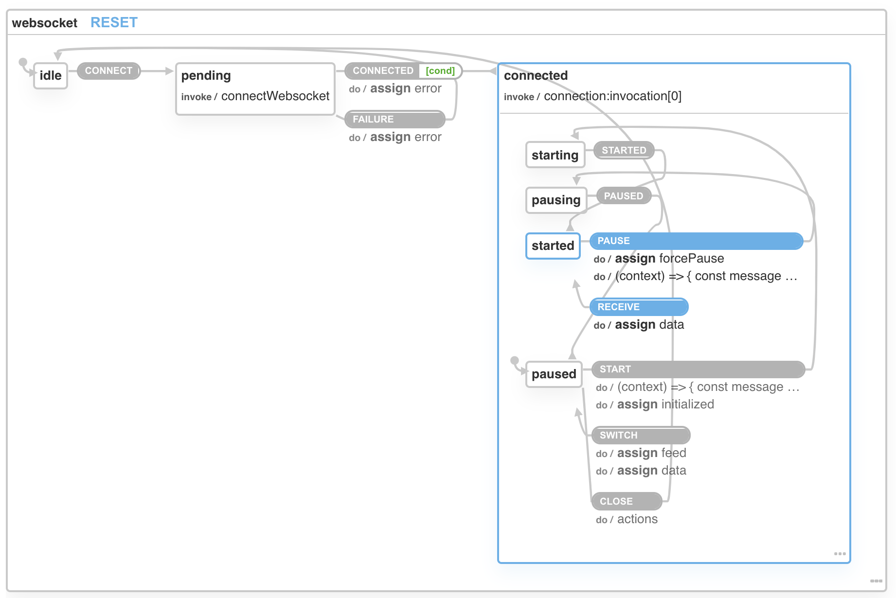

For a long time, [Redux](https://redux.js.org/) was the way to do state management in a React app. Bases on the [Flux](https://facebook.github.io/flux/) 
architecture, popularized by Facebook, it complements React's composable view components by utilizing a unidirectional data flow.

Redux works just fine, but the feeling is that you write too much code for the problem you're trying to solve. And, when you need to work with 
async operations, like API calls, you need to use something more complex like `react-thunk` or `react-saga`. The code feels needlessly complicated.

Over the years, people have come up with alternatives like [MobX](https://mobx.js.org/README.html), [Recoil](https://recoiljs.org/), [Immer](https://immerjs.github.io/immer/), [XState](https://xstate.js.org/docs/), 
and many others. Some people don't use any of them and replace Redux with a combination of hooks (useContext + useState / useReducer)

XState is a bit different from the rest, the state is managed by a finite state machine. As we saw in a [previous article](/short-introduction-to-xstate/)
this means that you can avoid "bad state" situations with XState. None of the other alternatives prevent a bad state.

To see how XState works with React, we'll look at a complex example, an XState machine for a WebSocket that provides cryptocurrency orders ([cryptofacilities.com's](https://www.cryptofacilities.com/) websocket: wss://www.cryptofacilities.com/ws/v1). Why a complex example?
Because this is where XState shines when certain actions are available only in certain states.

To get data from the websocket we need to do the following steps:
1. Initialize the websocket
```JavaScript
const socket = new WebSocket('https://www.cryptofacilities.com/');
const connectedHandler = () => { console.log('Connected')};

socket.addEventListener('open', connectedHandler);         

const messageHandler = (e) => { console.log('Message received', e.data)};
socket.addEventListener('message', messageHandler);   
```
2. Subscribe to a specific cryptocurrency data
```JavaScript
const subscribeEvent = {
  "event": "subscribe",
  "feed": "book_ui_1",
  "product_ids": ["PI_XBTUSD"]
}
socket.send(JSON.stringify(subscribeEvent));
```
3. Wait for the websocket to acknowledge the subscription
```JavaScript

// update the messageHandler to handle subscribed events
const messageHandler = (e) => { 
  console.log('Message received', e.data);
  
   if(/"event"/g.test(e.data)) {
    if(/"subscribed"/g.test(e.data)) {
      console.log('Subscribed');
    }
  }
};
```
4. Receive the initial data from the websocket as a snapshot 
```JavaScript
// update the messageHandler to handle snapshots
const messageHandler = (e) => { 
  console.log('Message received', e.data);
  
  if(/"event"/g.test(e.data)) {
    if(/"subscribed"/g.test(e.data)) {
      console.log('Subscribed');
    }
  }
  else {
    if(/snapshot/g.test(data.feed)) {
      console.log('Snapshot received');
    }  
  }
};
```
5. Receive data changes(deltas) from the websocket
```JavaScript
// update the messageHandler to handle deltas
const messageHandler = (e) => { 
  console.log('Message received', e.data);
  
  if(/"event"/g.test(e.data)) {
    if(/"subscribed"/g.test(e.data)) {
      console.log('Subscribed');
    }
  }
  else {
    if(/snapshot/g.test(data.feed)) {
      console.log('Snapshot received');
    }  
    else {
      console.log('Deltas received');
    }
  }
};
```
6. Unsubscribe from the cryptocurrency data
```JavaScript

// send unsubscribe event
const unsubscribeEvent = {
  "event": "unsubscribe",
  "feed": "book_ui_1",
  "product_ids": ["PI_XBTUSD"]
}
socket.send(JSON.stringify(unsubscribeEvent));

// handle unsubscribe confirmation
const messageHandler = (e) => { 
  console.log('Message received', e.data);
  
  if(/"event"/g.test(e.data)) {
    if(/"subscribed"/g.test(e.data)) {
      console.log('Subscribed');
    } else if(/"unsubscribed"/g.test(e.data)) {
      console.log('Unsubscribed');
    }  
  }
  else {
    if(/snapshot/g.test(data.feed)) {
      console.log('Snapshot received');
    }  
    else {
      console.log('Deltas received');
    }
  }
};
```

7. Subscribe to another cryptocurrency data
```JavaScript
const subscribeEvent = {
  "event": "subscribe",
  "feed": "book_ui_1",
  "product_ids": ["PI_ETHUSD"]
}
socket.send(JSON.stringify(subscribeEvent));
```
To use correctly the websocket we need to have the right state:
* we cannot send events if the websocket is not connected
* we cannot subscribe to a coin if we are already subscribed to another, 
* we need to wait to unsubscribe before we can subscribe again


## A machine for a websocket

```JavaScript
let socket;

const wsMachine = Machine({
  id: 'websocket',
  initial: 'idle',
  context: {
    initialized: false,
    forcePause: false,
    feed: 'PI_XBTUSD',
    data: undefined,
    error: undefined,
  },
  states: {
    idle: {
      on: { 
        CONNECT: 'pending' 
      }
    },
    pending: {
      invoke: {
        id:'connectWebsocket',
        src: () => (callback) => {
          try {
            socket = new WebSocket('wss://www.cryptofacilities.com/ws/v1');

            const connectedHandler = () => callback('CONNECTED');
            socket.addEventListener('open', connectedHandler);            

            return () => {
              socket?.removeEventListener('open', connectedHandler);
            };  
          } catch(err) {
            callback({ type: 'FAILURE', error: err} );
          }
        }
      },
      on: {
         CONNECTED: {
           target: 'connected',             
           cond: (context) => !!socket && !!context.feed,
           actions: assign({ error: (context, event) => undefined })
         },  
         FAILURE: {
          target: 'idle',
          actions: assign({ error: (context, event) => event.error })
         }  
      }
    },
    connected: {
      id:'connection',
      invoke: {
        src: () => (callback) => {
          const messageHandler = (e) => {
              if(/"event"/g.test(e.data)) {
                if(/"unsubscribed"/g.test(e.data)) {
                  callback('PAUSED');                
                }
                else if(/"subscribed"/g.test(e.data)) {
                  callback('STARTED');
                }
              }
              else {
                if(/"snapshot"/g.test(e.data)) {
                  console.log('Handle snapshot');
                  callback({ type: 'RECEIVE', data: e.data} );
                } else {
                  console.log('Handle deltas');                  
                  // TODO merge current data with deltas
                  callback({ type: 'RECEIVE', data: e.data} );
                }
              }
          };              
          socket.addEventListener('message', messageHandler);    

          return () => {
            socket.removeEventListener('message', messageHandler);    
          };
        }
      },     
      initial: 'paused',
      states: {          
        starting: {
          on: {
            STARTED: {
              target:'started'
            }
          }
        },
        pausing :{
          on: {
            PAUSED: {
              target: 'paused',
            }, 
          }
        }, 
        started: {         
          on : {
            PAUSE: {
              target: 'pausing',
              actions: [
                assign({ forcePause: (context, event) => event.forced }),
                (context) => {
                  const unsubscribeEvent = {
                    "event": "unsubscribe",
                    "feed": "book_ui_1",
                    "product_ids": [`${context.feed}`]
                  }
                  socket?.send(JSON.stringify(unsubscribeEvent));
                }
              ]
            },           
            RECEIVE: {
              actions: assign({ data: (context, event) => event.data })
            },  
          },       
        },     
        paused: {          
          on: {
            START: {
              target: 'starting',
              actions: [
                (context) => {
                  const subscribeEvent = {
                    "event": "subscribe",
                    "feed": "book_ui_1",
                    "product_ids": [`${context.feed}`]
                  }
                  socket?.send(JSON.stringify(subscribeEvent));
                },
                assign({ initialized : (context, event) =>  true })
              ]
            },
            SWITCH: {
              actions: [
                assign({ feed : (context, event) =>  event.feed || context.feed }),
                assign({ data : (context, event) => {                  
                  return undefined;
                }}),                
              ]
            },
            CLOSE: {
              target: '#websocket.idle',
              actions: () => {
                socket?.close();            
              }
            }
          }
        }        
      }      
    }
  }
})
```
Tip: Copy the above code in the [XState visualizer](https://xstate.js.org/viz/) to see it in action.

Initially, the machine is idle and the first thing we need to do is to connect it.
The only event available is CONNECT, nothing else is available.  *Even if somehow an event like PAUSE or START is received, nothing happens*



After the machine is connected, it is in paused state. Here several events are available: START - to start the machine, SWITCH - to 
switch to another coin, and CLOSE - to close the websocket.


We need to start the machine so it can receive data from the websocket.



## Using the machine in React
First, we need to add XState and XState React libraries to your project:
```
npm i xstate @xstate-react
```
Then create the machine in a file like `websocket-machine.js` (note that `Machine` is deprecated in favor of `createMachine`)
```JavaScript
import { createMachine } from 'xstate';

export const wsMachine = createMachine({
  ... 
}  
```
We need to create a React context that uses the machine to create *an instance of the machine* as a service:
```JSX
import React, { createContext } from 'react';
import { useInterpret } from '@xstate/react';
import machine from './websocket-machine';

export const MachineContext = createContext(null);

export const MachineProvider = (props) => {
  const machineService = useInterpret(machine);

  return (
    <MachineContext.Provider value={ machineService }>
      {props.children}
    </MachineContext.Provider>
  );
};
```

Use the context in the part of the app that uses the machine:
```JSX
import MachineProvider from './machine-context';

<MachineProvider>
  <OrderbookDisplay/>   
</MachineProvider>
```
Finally, in the components that are children of `MachineProvider`, we can use the `machineService`:
```JSX
import React, { useContext } from 'react';
import { MachineContext } from './machine-context';

// machine data selector
const dataSelector = state => state.context.data;

const OrderbookDisplay = () => {
  // get the service from context
  const machineService = useContext(MachineContext);
  // get context data
  const data = useSelector(machineService, dataSelector) ;

  return <div>{JSON.stringify(data)}</div>  
}

export default OrderbookDisplay;
```
The machine context contains different things, but if you need only part of it, it's a good idea to use a selector to get only the part 
of context you need. Otherwise, when the other parts will update (e.g feed, error, etc), your component will refresh unnecessarily.

## Conclusion
You can use XState with React, you can even use it only for parts of the state that are important to get right. To me, XState looks like less code than Redux and has more robust state management.

The XState machine creation is the hardest part. It takes a bit of trial and error to create a perfect one that covers all angles.
But once you have it you can rely on it.